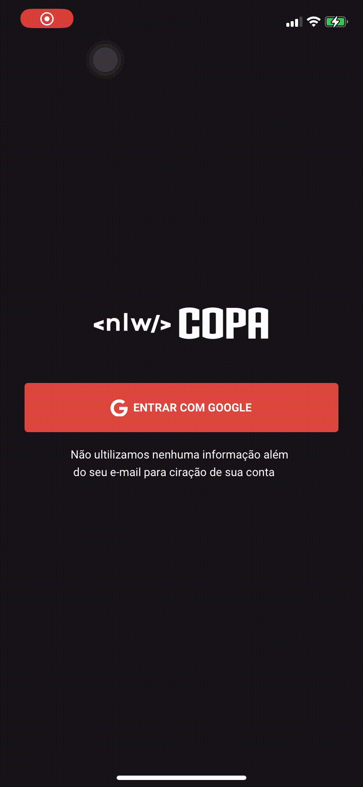
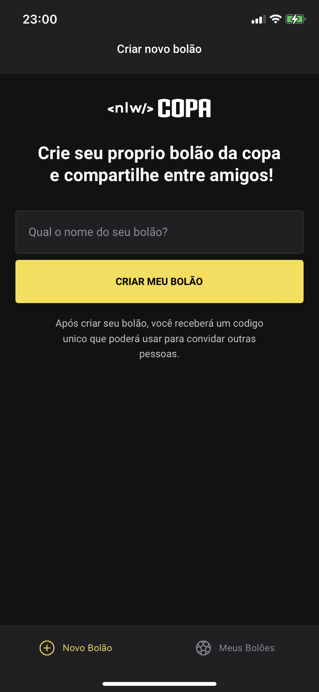
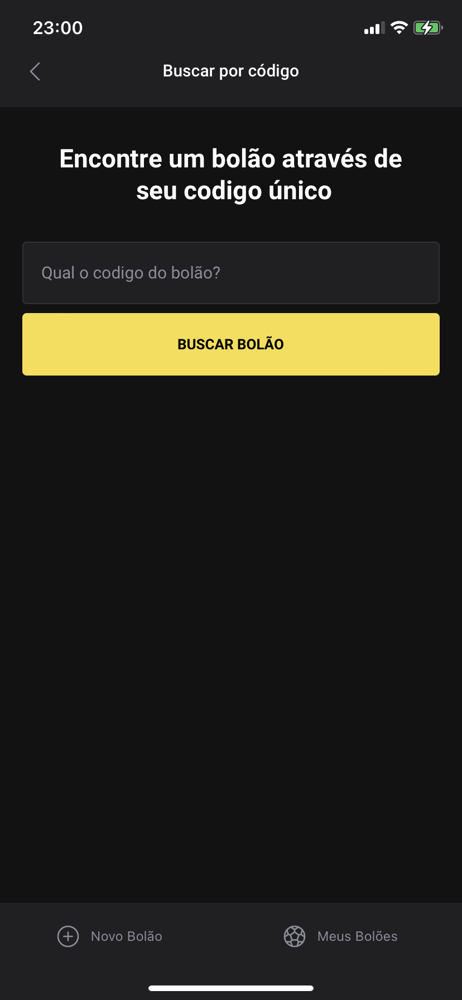

### ❓ App nlw copa

- App feito na semana nlw da @rocketseat.
### ⚠️ Features

- Navegação
    - Install react navigation
    - create routes
    - custom buttons tabs
    - navigation the application
    - navigation types
- Api Integration
    - Axios install
    - Access setup the api
    - Search data user the api
    - Insert token on request header
    - Redirect user the routes
## 📱 Current state

<code>

</code>
<code>

</code>
<code>

</code>

<code>

</code>

## 📌 Find me!
- Linkedin: https://www.linkedin.com/in/franklysg/
- Instagram: https://www.instagram.com/franklysg/
- Github: https://github.com/FranklysG